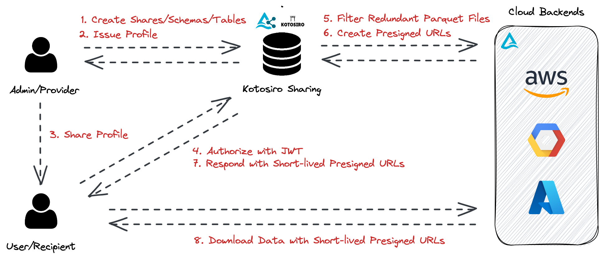

# Zero to Data

Hi there, data enthusiasts! Welcome to Zero to Data, where all things geeky and cutting edge converge. Whether you’re an aspiring technologist, seasoned practitioner, or looking to break into the newest Rust frameworks everyone is talking about, this site is for you! We’re aiming to be the go-to place for step-by-step tutorials, stories from the frontlines, and thoughts on current tech trends you should be investing time in. We hope you’ll enjoy putting your hands on keyboards, reading the blogs, and consider contributing your own insights!

## Featured Blogs

  

    
Open source self-hosted Delta Sharing server

     
    
  

  

    
Delta Lake & Ray for ML

     
    
  

